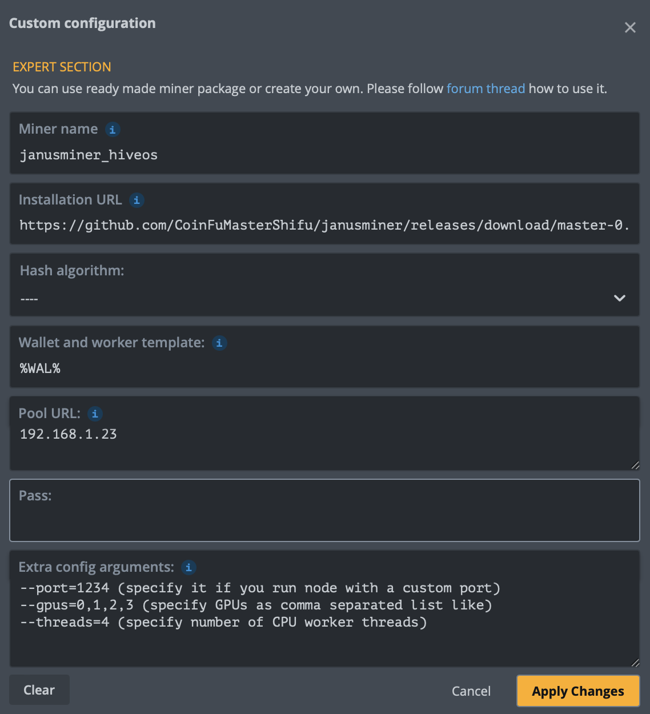

WARTHOG JANUSHASH MINER
Copyright (c) 2023 CoinFuMasterShifu, Pumbaa, Timon & Rafiki

  

## 📦 What is in the box?

* GPU/CPU Miner for Janushash

## 💻 System Requirements

* Linux
* gcc11 or newer
* meson
* ninja
* opencl

Note: Ubuntu 20.04 does not meet these requirements.

## 😵‍💫 BUILD INSTRUCTIONS

* Install gcc, meson, ninja: apt install meson ninja-build build-essential
* Clone the repo: `git clone https://github.com/CoinFuMasterShifu/janusminer`
* cd into the repo: `cd janusminer`
* Create build directory: `meson build .` (`meson build . --buildtype=release` for better performance)
* cd into build directory: `cd build`
* [Optional] For old OpenCL headers (like on Ubuntu 20.04):
  - `meson configure -Dopencl-legacy=true`
* Compile using ninja: `ninja`

### Docker build
#### System Requirements

* Linux
* Docker

#### Build for Linux

##### Ubuntu 18.04
* Run `DOCKER_BUILDKIT=1 docker build . -f Dockerfiles/Dockerfile_Ubuntu18 --output build` in the repo directory.
##### Ubuntu 20.04
* Run `DOCKER_BUILDKIT=1 docker build . -f Dockerfiles/Dockerfile_Ubuntu20 --output build` in the repo directory.
##### Ubuntu 22.04
* Run `DOCKER_BUILDKIT=1 docker build . -f Dockerfiles/Dockerfile_Ubuntu22 --output build` in the repo directory.

Binaries are located in `./build` directory.

## ▶️ USAGE

* Linux only at the moment
* Compile with meson/ninja
* Run the miner (use some restarter in case it crashes)
* In case you are unsure, things should work exactly as in [this Warthog node guide](https://github.com/warthog-network/warthog-guide)

### General Options
Parameter | Description
| ------------- | ------------- |
|  --help                                              |    Help screen. |
|  -V, --version                                    |    Print version and exit. |
|  -a,  --address=WALLETADDRESS |    Specify wallet address to mine on. |
|  --gpus=STRING                             |    Specify GPUs as comma separated list like "0,2,3".  By default all GPUs are used.
|  -t, --threads=INT                            |    Number of CPU worker threads, use 0 for hardware concurrency.   (default='0')
|  -h, --host=STRING                        |    Host (RPC-Node)  (default='localhost')
|  -p, --port=INT                                |    Port (RPC-Node)  (default='3000')

### One line example to start mining
`screen -dmS janusminer bash -c "while true; do ~/janusminer-ubuntu22 -a YOUR_WALLET_ADDRESS -h YOU_NODE_IP -p YOUR_NODE_PORT; done"`

### Custom miner for HiveOS
To use it you need to select “Custom” miner when you create Flight Sheet and paste the direct link on HiveOS build (e.g. janusminer_hiveos-0.0.1.tgz) from Releases into "Installation URL'".

#### Fligh Sheet example for HiveOS

